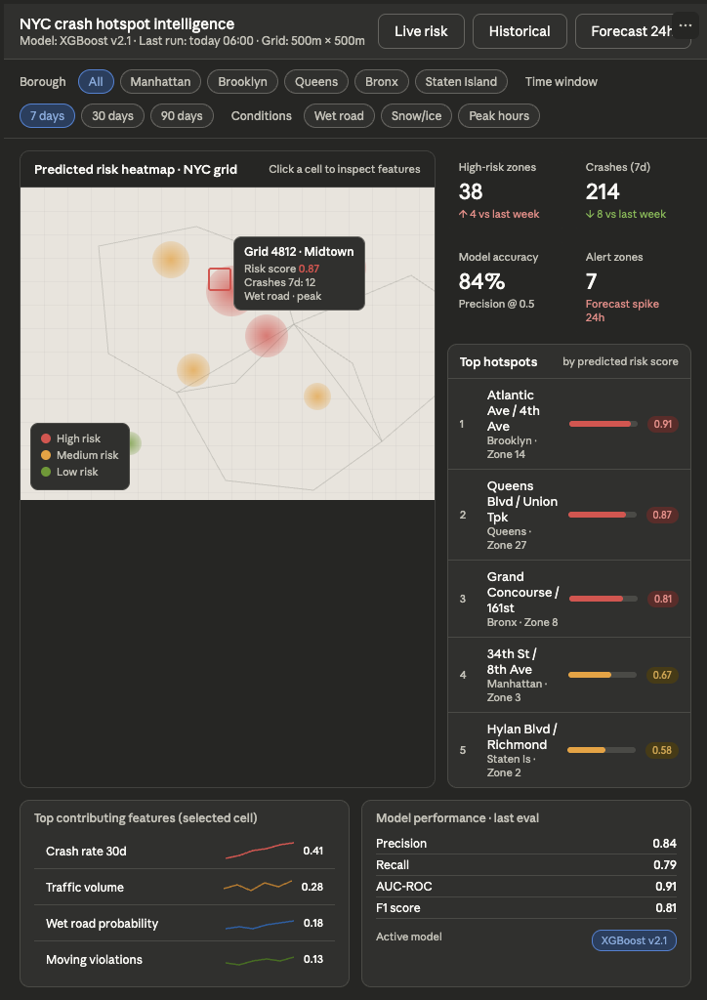
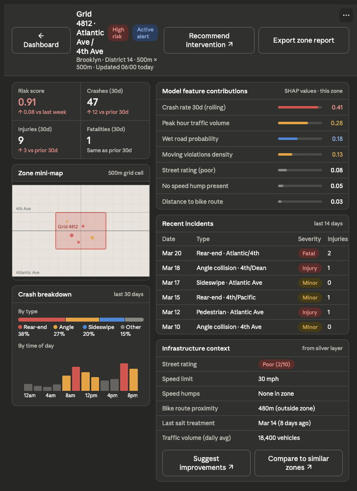
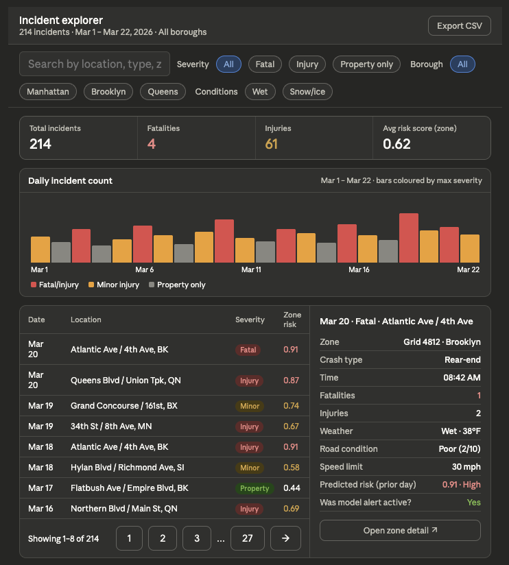
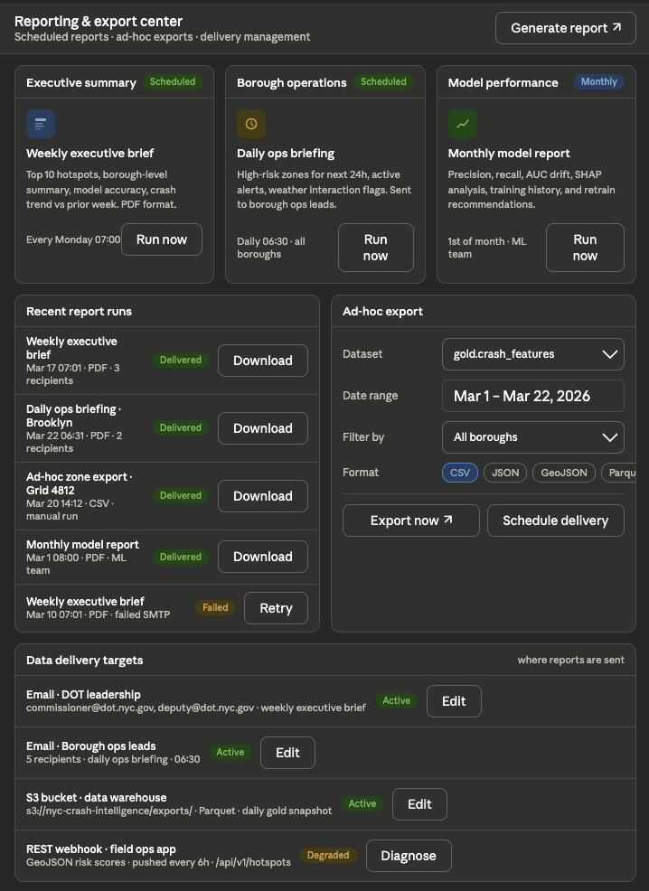
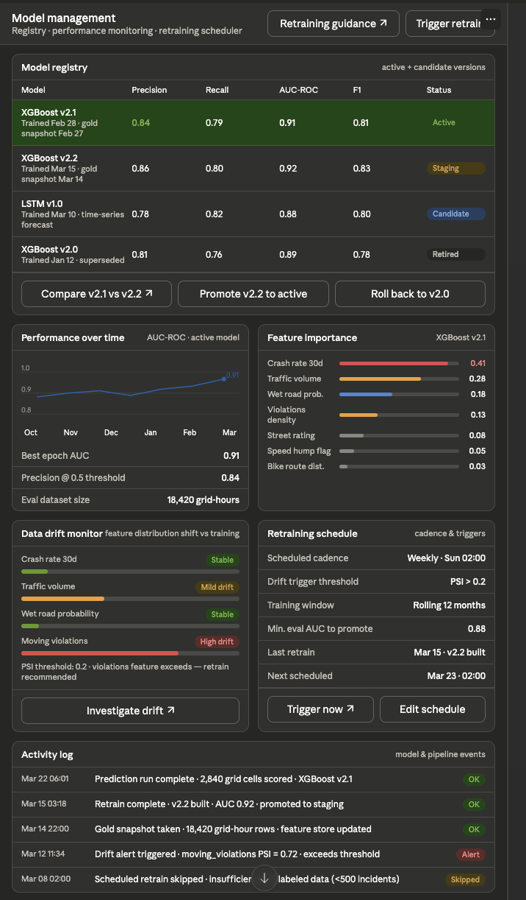

# Wireframes

## Home page

Main page: [`nyc_crash_hotspot_dashboard_wireframe.html`](mock_design_html/nyc_crash_hotspot_dashboard_wireframe.html)

## Secondary (supporting) pages

### `zone_grid_drilldown.html`

- Zone drill-down is the core analytical surface — it's where a DOT analyst lands after clicking a cell on the main heatmap, giving them SHAP-level explainability, infrastructure context, and a direct path to recommending interventions.

### `incident_explorer_timeline.html`

- Incident explorer is the audit trail, letting analysts cross-reference model predictions against ground truth.

### `reporting_export_center.html`

- Reporting center closes the loop for stakeholders who don't live in the app, with a GeoJSON webhook.

## ML model training

