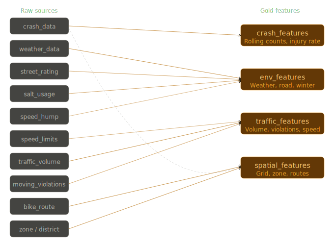

# Bronze, Silver, Gold Layers

### Bronze: raw tables drawn from ingestion
11 "raw" Tables:
- raw.crash_data
- raw.salt_usage_data
- raw.bike_route_data
- raw.district_grid_data
- raw.moving_violations_data
- raw.speed_hump_data
- raw.speed_limits_data
- raw.street_rating_data
- raw.traffic_volume_cnt_data
- raw.weather_data
- raw.zone_map_data

### Silver: Cleaned and validated data (Deduplicated, geocoded, joined, null-handled, typed)
Key purpose: geocoding crash lat/lons to grid cells, spatial joining everything to the district grid, resampling traffic volume to hourly buckets, normalising street ratings, and flagging winter treatment events. 

Models:
- silver.crashes (geocoded and typed)
- silver.road_conditions (rating + humps + limits)
- silver.weather_hourly (normalised + imputed)
- silver.grid_zones (spatial join, indexed)
- silver.violations (aggregated by zone)
- silver.traffic_vol (resampled hourly)
- silver.bike_route (route proximity flags)
- silver.salt_events (winter treatment log)

### Gold: Feature store
Key purpose: All features are keyed on (grid_cell_id, timestamp) and exist as join key for the model. The four feature groups map cleanly to "raw" sources: crash features carry rolling counts and injury rates, env features bundle weather + road condition + salt events, traffic features combine volume with violations and speed compliance, and spatial features encode proximity to bike routes, zone type, and grid topology.

Models:
- gold.crash_features
- gold.env_features
- gold.traffic_features
- gold.spatial_features

### Bronze to Gold Architecture

# Wireframe
[NYC crash hotspot dashboard wireframe](readme_resources/nyc_crash_hotspot_dashboard_wireframe.html)